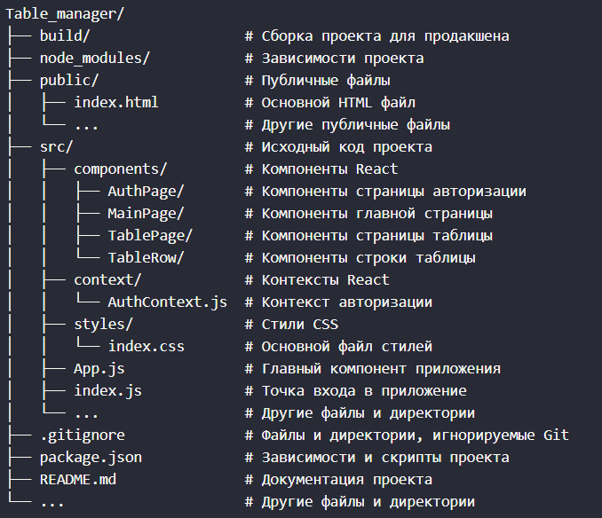

# Task manager


# Instructions for Running the Project for Local Development

1. Clone the repository:
   ```bash
   git clone https://github.com/your-repo/Table_manager.git
   cd Table_manager
   ```
2. Install dependencies:
   ```bash
   npm install
   ```
3. Run the project in development mode:
   ```bash
   npm start
   ```
